# WORKSHOP C++ - NOVEMBRE 2024 🏵

BUT : Apprendre à coder des effets sur des images.

BILAN : J'ai beaucoup aimé ce workshop. Je l'ai trouvé très épanouissant. Je remarque que mon utilisation de CHAT GPT peut être trop abusive. Je préférais coder sans mais c'est presque devenu une "addiction". Ça me donne envie de me forcer à coder sans. Il faudrait l'utiliser qu'en dernier recours.

Aussi, ce workshop m'a donné envie de faire du Shader Art Coding. [Vidéo](https://www.youtube.com/watch?v=f4s1h2YETNY)

### Ne garder que le vert 🦎

### Échanger les canaux 🤼‍♀️

### Noir et Blanc 👁‍🗨

### Négatif 👩‍🎤

### Dégradé 🌫

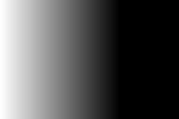

### Miroir 🌜🌛

### Image Bruitée 🛰

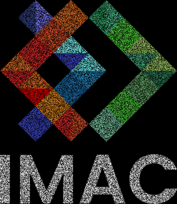

### Rotation de 90 ↪️

### RGB Split ⛑🐊🛝

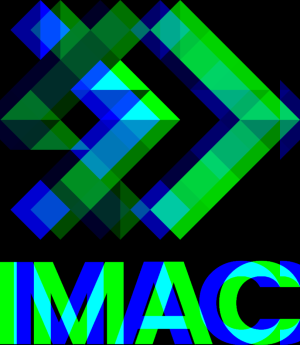

### Luminosité 🌤

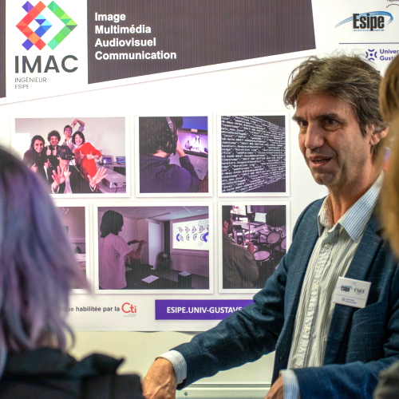

### Disque 🏀

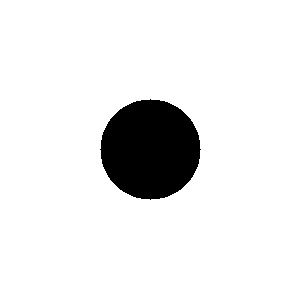

### Cercle 🪐

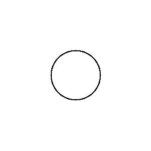

### AnimatioooOOOooon 🕺

### Rosace 🌸

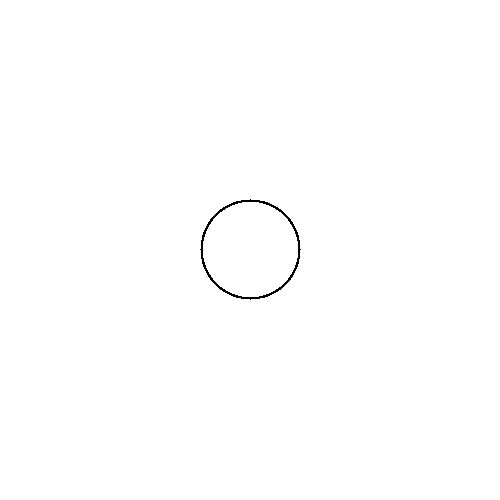

### Mosaïque 🧮

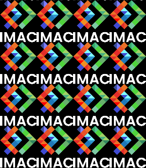

### Mosaïque Miroir 🫱🫲

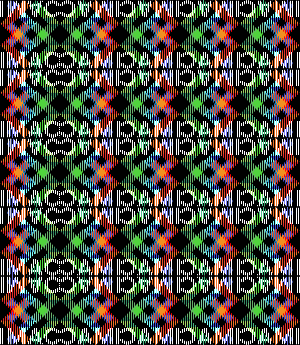

Truc pas voulu : 

### Glitch 🦈

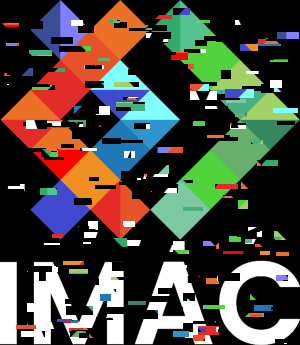

### Dégradé dans l'espace Couleur Lab 🪲

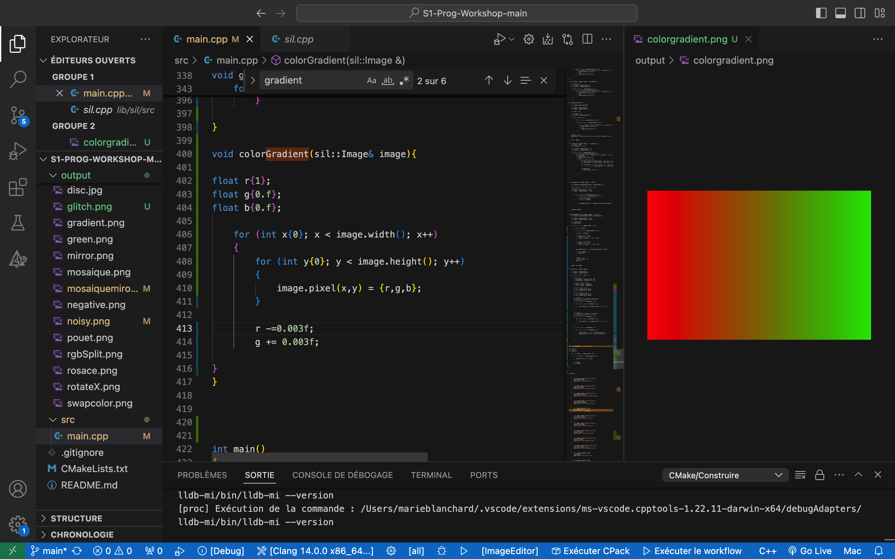
Gradient avec RGB

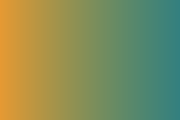
Gradient avec le passage de couleur en Couleur Lab

### Fractale 🖤

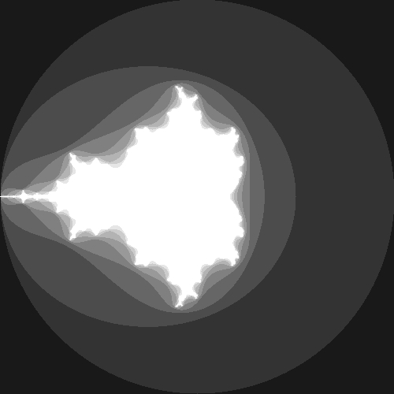

### Tramage 🌀

### Normalisation de l'Histogramme 〰️

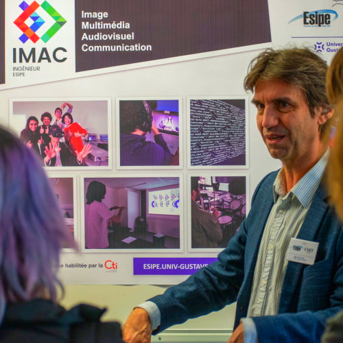

### Vortex 🍪

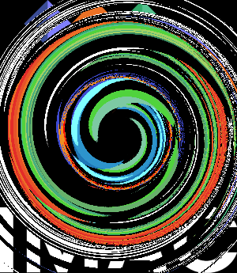

