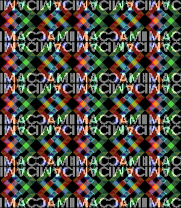

# WORKSHOP C++ - NOVEMBRE 2024 🏵

**BUT** : Apprendre à coder des effets sur des images.

**BILAN** : J'ai beaucoup aimé ce workshop. Je l'ai trouvé très épanouissant. Je remarque que mon utilisation de CHAT GPT peut être trop abusive. Je préférais coder sans mais c'est presque devenu une "addiction". Ça me donne envie de me forcer à coder sans. Il faudrait l'utiliser qu'en dernier recours.

Aussi, ce workshop m'a donné envie de faire du Shader Art Coding. [Vidéo](https://www.youtube.com/watch?v=f4s1h2YETNY)

### Ne garder que le vert 🦎

### Échanger les canaux 🤼‍♀️

### Noir et Blanc 👁‍🗨

### Négatif 👩‍🎤

### Dégradé 🌫

### Miroir 🌜🌛

### Image Bruitée 🛰

### Rotation de 90 ↪️

### RGB Split ⛑🐊🛝

### Luminosité 🌤

### Disque 🏀

### Cercle 🪐

### AnimatioooOOOooon 🕺

### Rosace 🌸

Cet exercice a été un grand moment de galère car impossible d'échapper aux mathématiques. Les notons font peur mais avec un papier et Jules, j'ai compris.

En gros :
- Centre des 6 cercles = n * pi / 3
- Avec des conditions et une boucle, pour chaque n, vérifier que le pixel fait partie du cercle n.

### Mosaïque 🧮

### Mosaïque Miroir 🫱🫲

Truc pas voulu : 

### Glitch 🦈

L'effet que j'ai eu du mal à faire sans chat GPT car je ne comprenais pas comment copier des rectangles.

Finalement, explication du code :
Boucle qui tourne 100 fois :
- Taille du rect
- Position max de X et Y
- Def du point x et y des deux rectangles
- Créer une image des deux rectangles et remplissage des deux rectangles
- Les échanger

### Dégradé dans l'espace Couleur Lab 🪲

Gradient avec RGB

- Définir les deux couleurs
- Définir le coefficient multiplicateur et l'étape 
- Pour chaque pixel mixé les deux couleurs en fonction du pourcentage définie par le coef et l'étape

Gradient avec le passage de couleur en Couleur Lab

- Passer les rgb en OkLab
- Pour chaque nouveau pixel, créer une nouvelle couleur OkLab en mixant les deux couleurs et les coef
- Conversion en rgb
- Assignation de la couleur au pixel

### Fractale 🖤

Pour chaque pixel : 
- Redéfinir x et y entre 2 et -2
- Définir c = x + yi / z = 0 + 0i et un compteur
- Boucle pour itérer avec la formule
- calculer l'intensité lumineuse
- assigner au pixel sa nouvelle couleur

### Tramage 🌀

Je ne comprends pas trop les matrices mais je me suis appuyée sur les articles.

- Définition de la matrice
Pour chaque pixel :
- On récupère la couleur du pixel
- On applique la formule avec la matrice pour avoir une nouvelle couleur
- On calcule la luminosité en faisant la moyenne des 3 composantes
- Si la luminosité est supérieure à 0.5, alors pixel noir sinon blanc

### Normalisation de l'Histogramme 〰️

- On parcourt tous les pixels d'une image pour stocké le pixel le plus et le moins lumineux.
- On parcourt un seconde fois les pixels de l'image en appliquant à chaque composante la formule exemple : (pixel.rouge - minimum_luminosité) / (maximum_luminosité - minimum_luminosité)

### Vortex 🍪

- On définie un angle de base, le centre de la rotation et la distance maximale
On parcourt chaque pixel :
- On calcule la distance entre le pixel et le centre de rotation
- On calcule l'angle en fonction du rapport entre la distance et la distance maximum
- Appliquer la fonction rotated sur le pixel avec le nouvel angle
- Appliquer la couleur du point rotated en vérifiant qu'il est bien entre 0 ett width/height